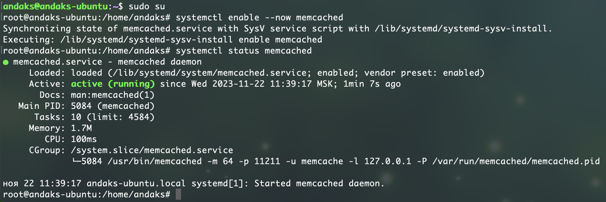

# Домашнее задание к занятию «Кеширование Redis/memcached» - Андрей Аксенов

---

### Задание 1. Кеширование 

Приведите примеры проблем, которые может решить кеширование. 

*Приведите ответ в свободной форме.*

#### Ответ на задание 1.

Кэширование призвано решать лишь одну проблему:
 повышение производительности при доступе к каким-либо данным. Каким именно, определяет администратор.
Если простыми словами, кэш - область в памяти ОЗУ или твердотельном накопителе, размещающая в себе определенные очереди на приемку и выдачу данных.
Приемка/выдача данных в кэш оперирует понятиями стеков ФИФО ЛИЛО и ТТЛ хранящихся в этой области данных.

---

### Задание 2. Memcached

Установите и запустите memcached.

*Приведите скриншот systemctl status memcached, где будет видно, что memcached запущен.*

#### Ответ на задание 2.

Скриншот установленного и запущенного memcached:

---

### Задание 3. Удаление по TTL в Memcached

Запишите в memcached несколько ключей с любыми именами и значениями, для которых выставлен TTL 5. 

*Приведите скриншот, на котором видно, что спустя 5 секунд ключи удалились из базы.*

#### Ответ на задание 3.

---

### Задание 4. Запись данных в Redis

Запишите в Redis несколько ключей с любыми именами и значениями. 

*Через redis-cli достаньте все записанные ключи и значения из базы, приведите скриншот этой операции.*

#### Ответ на задание 4.

---

## Дополнительные задания (со звёздочкой*)
Эти задания дополнительные, то есть не обязательные к выполнению, и никак не повлияют на получение вами зачёта по этому домашнему заданию. Вы можете их выполнить, если хотите глубже разобраться в материале.

### Задание 5*. Работа с числами 

Запишите в Redis ключ key5 со значением типа "int" равным числу 5. Увеличьте его на 5, чтобы в итоге в значении лежало число 10.  

*Приведите скриншот, где будут проделаны все операции и будет видно, что значение key5 стало равно 10.*
